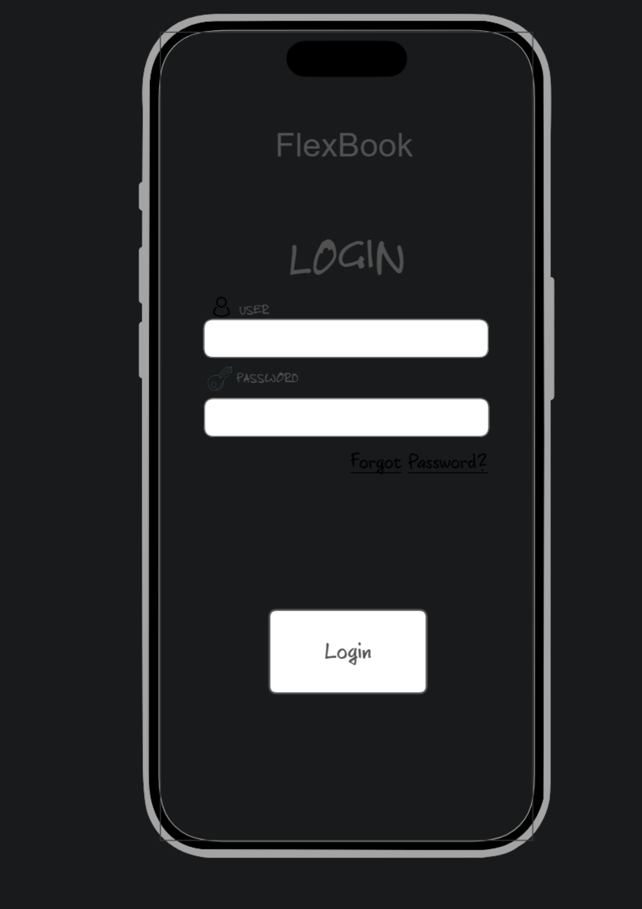
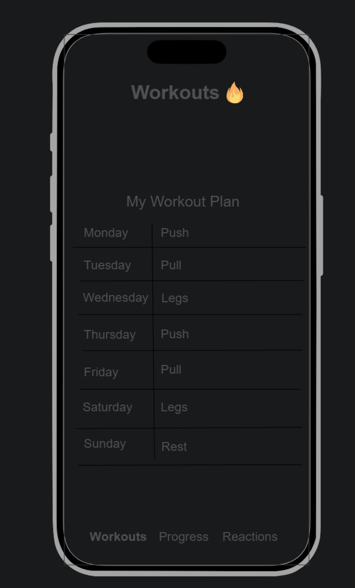
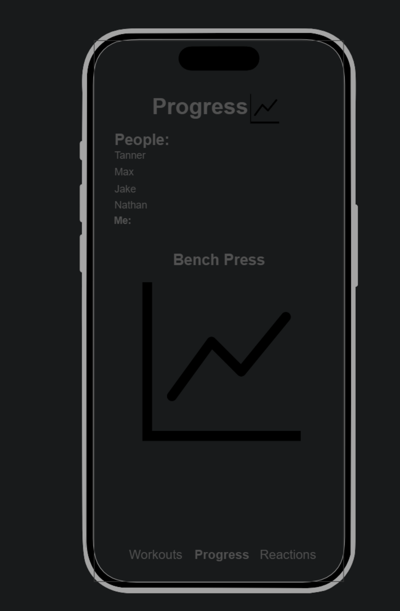
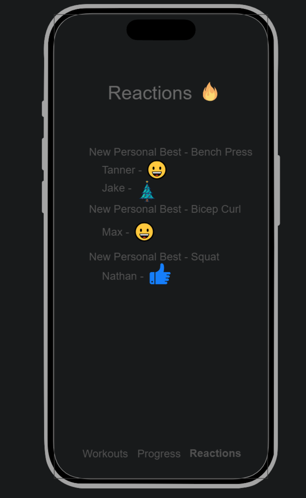

# FlexBook

[My Notes](notes.md)

FlexBook is a fitness tracking app that allows users to connect and share their personal progress with others. Add and customize specialized workouts and view your progress over time. Check and react to the progress of your friends. Celebrate together as everyone works towards their getting their gains.

## 🚀 Specification Deliverable

For this deliverable I did the following. I checked the box `[x]` and added a description for things I completed.

- [x] Proper use of Markdown
- [x] A concise and compelling elevator pitch
- [x] Description of key features
- [x] Description of how you will use each technology
- [x] One or more rough sketches of your application. Images must be embedded in this file using Markdown image references.

### Elevator pitch

Have you ever wanted to track your workouts and fitness goals but also those of your friends? FlexBook allows you to track your progress and track the progess of others. Each user can implement custom workouts and record their results, and then view the results of others. Once someone has reached an important milestone or recorded a personal best, they can choose to notify their friends through putting their results on their friend's feed.

### Design

Note: All of these sketches are done on a mobile phone as that is what I imagine the primary device type used would be for this type of web app, but I will design a proper web interface for a computer as well.

### Key features

- Secure login over HTTPS
- Add specific exercises to a custom workout plan
- Record the weight, sets, and reps completed for each exercise
- Track your progess over time
- Add friends from existing users
- View workouts of your friends
- Customize the results you share with your friends
- Add fitness goals and choose to share with your friends when you reach said goals
- React to your friends progress as they reach their goals

### Technologies

I am going to use the required technologies in the following ways.

- **HTML** - Uses correct HTML structure for application. HTML pages for login, your workouts, your reactions feed, and personal progress.
- **CSS** - Application styling that looks good on different screen sizes, uses good whitespace, color choice and contrast.
- **React** - Provides login, progresses through each workout, updates progress chart, updates reactions feed.
- **Service** - Backend service with endpoints for:
  - login
  - updating friends list
  - updating workout logs
  - updating and reacting to friends feed
  - https://github.com/cheatsnake/emojihub for emojis to react with 
  - https://wger.de/en/software/api for access to robust list of workouts
- **DB/Login** - Register, and login users. Store workouts, progress, and reactions. Credentials stored securely in database.
- **WebSocket** - When a user reacts to another user's new personal best, send a notification to the original user.

## 🚀 AWS deliverable

For this deliverable I did the following. I checked the box `[x]` and added a description for things I completed.

- [x] **Server deployed and accessible with custom domain name** - [My server link](http://flexbook.click).

## 🚀 HTML deliverable

For this deliverable I did the following. I checked the box `[x]` and added a description for things I completed.

- [x] **HTML pages** - 4 HTML pages for signing in, workouts, progress, and reactions.
- [x] **Proper HTML element usage** - BODY, NAV, MAIN, HEADER, FOOTER all used.
- [x] **Links** - All pages link to all other pages and a sign out link at the bottom of each page which links back to index.html.
- [x] **Text** - Placeholder text in workouts.html to show how an exercise is completed.
- [x] **3rd party API placeholder** - Emoji's will be supplied from https://github.com/cheatsnake/emojihub for reactions and workouts will be supplied from https://wger.de/en/software/api along with useful data on exercises.
- [x] **Images** - Bench press and graph placeholder images placed in progress.html.
- [x] **Login placeholder** - Login placeholder in index.html.
- [x] **DB data placeholder** - Log in boxes for user verification, user data (friends list, workouts, progress, reactions).
- [x] **WebSocket placeholder** - Recent reactions from your friend's represents data sent instantly from your friends.

## 🚀 CSS deliverable

For this deliverable I did the following. I checked the box `[x]` and added a description for things I completed.

- [x] **Header, footer, and main content body** - I changed the header and footer to match across all webpages and updated the designs.
- [x] **Navigation elements** - I made all navigation done through a drop down from the navbar.
- [x] **Responsive to window resizing** - My app looks great on all sizes of screens and devices.
- [x] **Application elements** - Added tables and cards to workouts.html and reactions.html and styled them to be consistent with the rest of my design.
- [x] **Application text content** - Used the same font throughout for consistency.
- [x] **Application images** - Added round cornering to image (also got rid of benchpress placeholder image as I thought it cluttered upt the design and was unnecessary).

## 🚀 React part 1: Routing deliverable

For this deliverable I did the following. I checked the box `[x]` and added a description for things I completed.

- [x] **Bundled using Vite** - I installed Vite to my project directory and used it to install the required dependencies.
- [x] **Components** - React components return the basic html for the login, progress, workouts, and reactions pages.
- [x] **Router** - I added routing for all of the webpages.

## 🚀 React part 2: Reactivity deliverable

For this deliverable I did the following. I checked the box `[x]` and added a description for things I completed.

- [x] **All functionality implemented or mocked out** - Although I did get everything working, I feel like I may have missed some functionality in some places, and I'm not 100% sure that I'm following all best practices
- [x] **Hooks** - Several useState and useEffect hooks littered all around the project

## 🚀 Service deliverable

For this deliverable I did the following. I checked the box `[x]` and added a description for things I completed.

- [x] **Node.js/Express HTTP service** - Installed Express with NPM. Default port on 4000.js.
- [x] **Static middleware for frontend** - Simple endpoints in 'service/index'.
- [x] **Calls to third party endpoints** - About page calls 'https://quoteslate.vercel.app/api/quotes/random', renders the resulting JSON with React
- [x] **Backend service endpoints** - Several endpoints in 'sevice/index' for adding workouts, deleting them, getting them, and also the same for interacting with your friends list (many of them to be part of the webhook implementation later)
- [x] **Frontend calls service endpoints** - All mocked functionality removed from the frontend and replaced with calls to the service.
- [x] **Supports registration, login, logout, and restricted endpoint** - Fully support authentication and restrict access to scores.

## 🚀 DB deliverable

For this deliverable I did the following. I checked the box `[x]` and added a description for things I completed.

- [x] **Stores data in MongoDB** - Workout and exercise database logic is fully added functional. Adding friends and reactions also stores data to the database, however it doesn't actually link to any existing users yet. I figured that this extra functionality wasn't 100% necessary as it is extra complicated and perhaps above the scope of this class. For now, these buttons still exist on the front end as maybe if I have extra time I can get around to getting these to work exactly as I initially envisioned it at the start of the class.
- [x] **Stores credentials in MongoDB** - Stores the users email and their password.

## 🚀 WebSocket deliverable

For this deliverable I did the following. I checked the box `[x]` and added a description for things I completed.

- [ ] **Backend listens for WebSocket connection** - I did not complete this part of the deliverable.
- [ ] **Frontend makes WebSocket connection** - I did not complete this part of the deliverable.
- [ ] **Data sent over WebSocket connection** - I did not complete this part of the deliverable.
- [ ] **WebSocket data displayed** - I did not complete this part of the deliverable.
- [ ] **Application is fully functional** - I did not complete this part of the deliverable.
